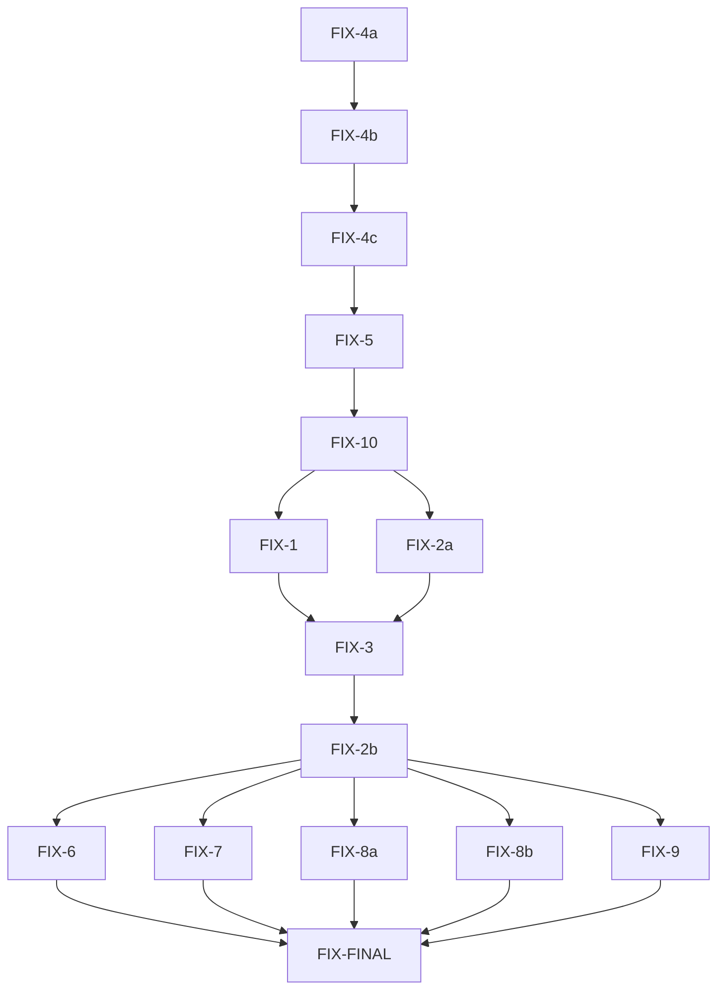

# Phase 3 Fix Plan -- Atomic Task Decomposition

## Plan Summary

This fix plan removes concrete implementations (`SystemProcessRunner`, `ShellHookExecutor`) from `workflow_core` (they already exist in `workflow_utils`), upgrades the `StateStore` trait to return references and add `Send + Sync`, converts `StateStoreExt` to a blanket impl, fixes the `Workflow::run()` signature to accept `&mut dyn StateStore` instead of `&mut JsonStateStore`, wires up hook execution that was previously no-oped, and fixes several test compilation/correctness issues.

---

## Phase 1 -- Foundational trait changes (no parallelism; each depends on the previous)

These tasks touch `workflow_core/src/state.rs` and must be applied sequentially because each changes the shape of the `StateStore` trait or its impls.

---

### FIX-4a: Add `Send + Sync` to `StateStore`, return references, remove `load()` from trait

- **Task ID**: FIX-4a
- **File**: `/Users/tony/programming/castep_workflow_framework/workflow_core/src/state.rs`
- **Target**: `pub trait StateStore`
- **Before**:
```rust
pub trait StateStore {
    /// Returns the current status of a task.
    fn get_status(&self, id: &str) -> Option<TaskStatus>;

    /// Sets the status of a task and updates timestamp.
    fn set_status(&mut self, id: &str, status: TaskStatus);

    /// Returns all task IDs and their statuses.
    fn all_tasks(&self) -> HashMap<String, TaskStatus>;

    /// Persists the current state to disk.
    /// The path is owned by JsonStateStore and not passed explicitly.
    fn save(&self) -> Result<(), WorkflowError>;

    /// Loads state from disk. Running tasks are reset to Pending for crash recovery.
    fn load(path: impl AsRef<Path>) -> Result<JsonStateStore, WorkflowError>
    where
        Self: Sized;
}
```
- **After**:
```rust
pub trait StateStore: Send + Sync {
    /// Returns the current status of a task.
    fn get_status(&self, id: &str) -> Option<&TaskStatus>;

    /// Sets the status of a task and updates timestamp.
    fn set_status(&mut self, id: &str, status: TaskStatus);

    /// Returns all task IDs and their statuses.
    fn all_tasks(&self) -> &HashMap<String, TaskStatus>;

    /// Persists the current state to disk.
    /// The path is owned by JsonStateStore and not passed explicitly.
    fn save(&self) -> Result<(), WorkflowError>;
}
```
- **Verification**: `cd /Users/tony/programming/castep_workflow_framework && cargo check -p workflow_core 2>&1 | head -40` (expect errors from callers -- those are fixed in FIX-4b)
- **Depends on**: none
- **Can run in parallel with**: none (all FIX-4/5 tasks are sequential)

---

### FIX-4b: Update `impl StateStore for JsonStateStore` to match new signatures

- **Task ID**: FIX-4b
- **File**: `/Users/tony/programming/castep_workflow_framework/workflow_core/src/state.rs`
- **Target**: `impl StateStore for JsonStateStore`
- **Before**:
```rust
impl StateStore for JsonStateStore {
    fn get_status(&self, id: &str) -> Option<TaskStatus> {
        self.tasks.get(id).cloned()
    }

    fn set_status(&mut self, id: &str, status: TaskStatus) {
        self.tasks.insert(id.to_owned(), status);
        self.last_updated = now_iso8601();
    }

    fn all_tasks(&self) -> HashMap<String, TaskStatus> {
        self.tasks.clone()
    }

    fn save(&self) -> Result<(), WorkflowError> {
        self.save()
    }

    fn load(path: impl AsRef<Path>) -> Result<JsonStateStore, WorkflowError> {
        Self::load(path)
    }
}
```
- **After**:
```rust
impl StateStore for JsonStateStore {
    fn get_status(&self, id: &str) -> Option<&TaskStatus> {
        self.tasks.get(id)
    }

    fn set_status(&mut self, id: &str, status: TaskStatus) {
        self.tasks.insert(id.to_owned(), status);
        self.last_updated = now_iso8601();
    }

    fn all_tasks(&self) -> &HashMap<String, TaskStatus> {
        &self.tasks
    }

    fn save(&self) -> Result<(), WorkflowError> {
        self.save()
    }
}
```
- **Verification**: `cd /Users/tony/programming/castep_workflow_framework && cargo check -p workflow_core 2>&1 | head -40` (expect errors from callers in `state.rs` tests -- those are fixed next)
- **Depends on**: FIX-4a
- **Can run in parallel with**: none

---

### FIX-4c: Fix `state.rs` test assertions for reference returns

- **Task ID**: FIX-4c
- **File**: `/Users/tony/programming/castep_workflow_framework/workflow_core/src/state.rs`
- **Target**: `mod tests` (multiple test functions)

After FIX-4a/4b, `get_status()` returns `Option<&TaskStatus>` instead of `Option<TaskStatus>`. Callers using `==` comparisons need updating.

- **Before** (in `round_trip_json`):
```rust
        assert!(loaded.get_status("a") == Some(TaskStatus::Completed));
```
- **After**:
```rust
        assert!(matches!(loaded.get_status("a"), Some(TaskStatus::Completed)));
```

- **Before** (in `status_transitions`):
```rust
        assert!(s.get_status("a") == Some(TaskStatus::Running));
        s.mark_completed("a");
        assert!(s.get_status("a") == Some(TaskStatus::Completed));
```
- **After**:
```rust
        assert!(matches!(s.get_status("a"), Some(TaskStatus::Running)));
        s.mark_completed("a");
        assert!(matches!(s.get_status("a"), Some(TaskStatus::Completed)));
```

- **Before** (in `load_resets_running_to_pending`):
```rust
        assert_eq!(loaded.get_status("task1"), Some(TaskStatus::Pending));
        assert_eq!(loaded.get_status("task2"), Some(TaskStatus::Completed));
        // Add these three lines
        assert_eq!(loaded.get_status("task3"), Some(TaskStatus::Pending));
        assert_eq!(loaded.get_status("task4"), Some(TaskStatus::Pending));
        assert_eq!(loaded.get_status("task5"), Some(TaskStatus::Skipped)); // must NOT reset
```
- **After**:
```rust
        assert!(matches!(loaded.get_status("task1"), Some(TaskStatus::Pending)));
        assert!(matches!(loaded.get_status("task2"), Some(TaskStatus::Completed)));
        assert!(matches!(loaded.get_status("task3"), Some(TaskStatus::Pending)));
        assert!(matches!(loaded.get_status("task4"), Some(TaskStatus::Pending)));
        assert!(matches!(loaded.get_status("task5"), Some(TaskStatus::Skipped)));
```

- **Before** (in `atomic_save`):
```rust
        assert!(loaded.get_status("test") == Some(TaskStatus::Completed));
```
- **After**:
```rust
        assert!(matches!(loaded.get_status("test"), Some(TaskStatus::Completed)));
```

- **Before** (in `save_load_roundtrip`):
```rust
        assert_eq!(s1.get_status("t1"), s2.get_status("t1"));
        assert_eq!(s1.get_status("t2"), s2.get_status("t2"));
        assert_eq!(s1.get_status("t3"), s2.get_status("t3"));
```
- **After**:
```rust
        assert_eq!(s1.get_status("t1").cloned(), s2.get_status("t1").cloned());
        assert_eq!(s1.get_status("t2").cloned(), s2.get_status("t2").cloned());
        assert_eq!(s1.get_status("t3").cloned(), s2.get_status("t3").cloned());
```

- **Verification**: `cd /Users/tony/programming/castep_workflow_framework && cargo test -p workflow_core --lib state::tests 2>&1 | tail -20`
- **Depends on**: FIX-4b
- **Can run in parallel with**: none

---

### FIX-5: Convert `StateStoreExt` to blanket impl with default methods

- **Task ID**: FIX-5
- **File**: `/Users/tony/programming/castep_workflow_framework/workflow_core/src/state.rs`
- **Target**: `pub trait StateStoreExt` and `impl StateStoreExt for JsonStateStore`

Replace the bodiless trait and its explicit impl with a supertrait that has default method bodies, plus a blanket impl.

- **Before** (the trait definition, lines 45-69):
```rust
/// Extension trait providing convenience methods for state management.
pub trait StateStoreExt {
    /// Marks a task as running and updates the last_updated timestamp.
    fn mark_running(&mut self, id: &str);

    /// Marks a task as completed and updates the last_updated timestamp.
    fn mark_completed(&mut self, id: &str);

    /// Marks a task as failed with the provided error message.
    fn mark_failed(&mut self, id: &str, error: String);

    /// Marks a task as pending and updates the last_updated timestamp.
    fn mark_pending(&mut self, id: &str);

    /// Marks a task as skipped and updates the last_updated timestamp.
    fn mark_skipped(&mut self, id: &str);

    /// Marks a task as skipped due to upstream dependency failure.
    fn mark_skipped_due_to_dep_failure(&mut self, id: &str);

    /// Returns a summary of all task statuses.
    fn summary(&self) -> StateSummary;

    /// Checks if a task is completed.
    fn is_completed(&self, id: &str) -> bool;
}
```
- **After**:
```rust
/// Extension trait providing convenience methods for state management.
pub trait StateStoreExt: StateStore {
    /// Marks a task as running and updates the last_updated timestamp.
    fn mark_running(&mut self, id: &str) {
        self.set_status(id, TaskStatus::Running);
    }

    /// Marks a task as completed and updates the last_updated timestamp.
    fn mark_completed(&mut self, id: &str) {
        self.set_status(id, TaskStatus::Completed);
    }

    /// Marks a task as failed with the provided error message.
    fn mark_failed(&mut self, id: &str, error: String) {
        self.set_status(id, TaskStatus::Failed { error });
    }

    /// Marks a task as pending and updates the last_updated timestamp.
    fn mark_pending(&mut self, id: &str) {
        self.set_status(id, TaskStatus::Pending);
    }

    /// Marks a task as skipped and updates the last_updated timestamp.
    fn mark_skipped(&mut self, id: &str) {
        self.set_status(id, TaskStatus::Skipped);
    }

    /// Marks a task as skipped due to upstream dependency failure.
    fn mark_skipped_due_to_dep_failure(&mut self, id: &str) {
        self.set_status(id, TaskStatus::SkippedDueToDependencyFailure);
    }

    /// Returns a summary of all task statuses.
    fn summary(&self) -> StateSummary {
        let mut s = StateSummary {
            pending: 0,
            running: 0,
            completed: 0,
            failed: 0,
            skipped: 0,
        };
        for status in self.all_tasks().values() {
            match status {
                TaskStatus::Pending => s.pending += 1,
                TaskStatus::Running => s.running += 1,
                TaskStatus::Completed => s.completed += 1,
                TaskStatus::Failed { .. } => s.failed += 1,
                TaskStatus::Skipped | TaskStatus::SkippedDueToDependencyFailure => s.skipped += 1,
            }
        }
        s
    }

    /// Checks if a task is completed.
    fn is_completed(&self, id: &str) -> bool {
        matches!(self.get_status(id), Some(TaskStatus::Completed))
    }
}

impl<T: ?Sized + StateStore> StateStoreExt for T {}
```

> **Architectural decision (2026-04-14)**: The blanket impl uses `?Sized` to relax the
> implicit `Sized` bound. This is required because `Workflow::run()` accepts
> `state: &mut dyn StateStore` (a trait object, which is unsized), and calls
> `StateStoreExt` convenience methods on it. Without `?Sized`, `dyn StateStore` does not
> satisfy the blanket impl and the compiler rejects calls like `state.mark_completed()`.
>
> Alternatives were evaluated and rejected:
> - **Making `run()` generic over `S: StateStore`**: would monomorphise a long imperative
>   loop for every concrete store type, bloating compile output and contradicting the
>   intentional use of runtime polymorphism.
> - **Making `StateStoreExt` a supertrait of `StateStore`**: creates a circular dependency
>   (`StateStoreExt: StateStore` and `StateStore: StateStoreExt`).
>
> The `?Sized` fix is the standard, idiomatic solution — used pervasively in the Rust
> standard library (e.g. `impl<T: ?Sized + Display> ToString for T`). It carries no
> coherence, object-safety, or double-impl risks.

Then **delete** the entire existing `impl StateStoreExt for JsonStateStore { ... }` block. Locate it by its opening line:
```rust
impl StateStoreExt for JsonStateStore {
    fn mark_running(&mut self, id: &str) {
```
Delete from that `impl` line through the matching closing `}`, including all method bodies inside it.

- **Verification**: `cd /Users/tony/programming/castep_workflow_framework && cargo test -p workflow_core --lib state::tests 2>&1 | tail -20`
- **Depends on**: FIX-4c
- **Can run in parallel with**: none

---

### FIX-10: Remove `tasks_mut()` dead code

- **Task ID**: FIX-10
- **File**: `/Users/tony/programming/castep_workflow_framework/workflow_core/src/state.rs`
- **Target**: second `impl JsonStateStore` block containing `tasks_mut`

- **Before**:
```rust
// Internal accessor for workflow module
impl JsonStateStore {
    pub(crate) fn tasks_mut(&mut self) -> &mut HashMap<String, TaskStatus> {
        &mut self.tasks
    }
}
```
- **After**: (delete entirely)
- **Verification**: `cd /Users/tony/programming/castep_workflow_framework && cargo check -p workflow_core 2>&1 | tail -10`
- **Depends on**: FIX-5 (do this after all state.rs trait work is done to avoid merge conflicts)
- **Can run in parallel with**: none

---

## Phase 2 -- Remove concrete impls from `workflow_core` and update re-exports (parallel pair)

These two tasks touch different files and can run in parallel.

---

### FIX-1: Remove `SystemProcessRunner` / `SystemProcessHandle` from `workflow_core/src/process.rs`

- **Task ID**: FIX-1
- **File**: `/Users/tony/programming/castep_workflow_framework/workflow_core/src/process.rs`
- **Target**: Everything after `pub struct ProcessResult { ... }`

**Step 1**: Delete everything from the comment `/// Concrete implementation of ProcessRunner for system processes.` through the end of the file. The block to remove starts with:
```rust
/// Concrete implementation of ProcessRunner for system processes.
pub struct SystemProcessRunner;

impl ProcessRunner for SystemProcessRunner {
```
and ends with the closing `}` of `impl ProcessHandle for SystemProcessHandle`. Everything before this block (the three trait/struct definitions — `ProcessRunner`, `ProcessHandle`, `ProcessResult`) must be kept.

**Step 2**: Update the imports at the top of the file.

- **Before** (lines 1-4):
```rust
use std::collections::HashMap;
use std::path::Path;
use std::process::{Child, Command, Stdio};
use std::time::{Duration, Instant};
```
- **After**:
```rust
use std::collections::HashMap;
use std::path::Path;
use std::time::Duration;
```

**Step 3**: Update re-exports in `workflow_core/src/lib.rs`.

- **Before** (line 11):
```rust
pub use process::{ProcessHandle, ProcessResult, ProcessRunner, SystemProcessRunner};
```
- **After**:
```rust
pub use process::{ProcessHandle, ProcessResult, ProcessRunner};
```

- **Verification**: `cd /Users/tony/programming/castep_workflow_framework && cargo check -p workflow_core 2>&1 | head -20` (expect errors from `workflow.rs` tests -- fixed in FIX-2b)
- **Depends on**: FIX-10 (all state.rs work done)
- **Can run in parallel with**: FIX-2a

---

### FIX-2a: Remove `ShellHookExecutor` from `workflow_core/src/monitoring.rs` and update re-exports

- **Task ID**: FIX-2a
- **File**: `/Users/tony/programming/castep_workflow_framework/workflow_core/src/monitoring.rs`
- **Target**: The `ShellHookExecutor` struct and its `impl HookExecutor` block

**Step 1**: Delete lines 74-105 (the doc comment, the struct, and the impl block).

- **Before** (lines 74-105):
```rust
/// Concrete implementation of HookExecutor that executes hooks via shell commands.
pub struct ShellHookExecutor;

impl HookExecutor for ShellHookExecutor {
    fn execute_hook(
        &self,
        hook: &MonitoringHook,
        ctx: &HookContext,
    ) -> Result<HookResult, WorkflowError> {
        let mut parts = hook.command.split_whitespace();
        let cmd = parts.next().unwrap_or_default();
        let args: Vec<String> = parts.map(String::from).collect();

        let output = std::process::Command::new(cmd)
            .args(&args)
            .env("TASK_ID", &ctx.task_id)
            .env("TASK_STATE", &ctx.state)
            .env("WORKDIR", ctx.workdir.to_string_lossy().as_ref())
            .env(
                "EXIT_CODE",
                ctx.exit_code.map(|c| c.to_string()).unwrap_or_default(),
            )
            .current_dir(&ctx.workdir)
            .output()
            .map_err(WorkflowError::Io)?;

        Ok(HookResult {
            success: output.status.success(),
            output: String::from_utf8_lossy(&output.stdout).into_owned(),
        })
    }
}
```
- **After**: (delete entirely -- the `#[cfg(test)] mod tests` block that follows should remain)

**Step 2**: Update re-exports in `workflow_core/src/lib.rs`.

- **Before** (line 10):
```rust
pub use monitoring::{HookContext, HookExecutor, HookResult, HookTrigger, MonitoringHook, ShellHookExecutor};
```
- **After**:
```rust
pub use monitoring::{HookContext, HookExecutor, HookResult, HookTrigger, MonitoringHook};
```

- **Verification**: `cd /Users/tony/programming/castep_workflow_framework && cargo check -p workflow_core 2>&1 | head -20` (expect errors from `workflow.rs` tests -- fixed in FIX-2b)
- **Depends on**: FIX-10 (all state.rs work done)
- **Can run in parallel with**: FIX-1

---

## Phase 3 -- Fix `workflow.rs` signature and tests (sequential, depends on Phase 2)

---

### FIX-3: Change `Workflow::run()` to accept `&mut dyn StateStore`

- **Task ID**: FIX-3
- **File**: `/Users/tony/programming/castep_workflow_framework/workflow_core/src/workflow.rs`
- **Target**: `pub fn run(` in `impl Workflow`

- **Before**:
```rust
    pub fn run(
        &mut self,
        state: &mut JsonStateStore,
        runner: Arc<dyn ProcessRunner>,
        _hook_executor: Arc<dyn HookExecutor>,
    ) -> Result<WorkflowSummary, WorkflowError> {
```
- **After**:
```rust
    pub fn run(
        &mut self,
        state: &mut dyn StateStore,
        runner: Arc<dyn ProcessRunner>,
        hook_executor: Arc<dyn HookExecutor>,
    ) -> Result<WorkflowSummary, WorkflowError> {
```

Also update the import line in `workflow.rs` to remove `JsonStateStore`:

- **Before** (line 5):
```rust
use crate::state::{JsonStateStore, StateStore, StateStoreExt, TaskStatus};
```
- **After**:
```rust
use crate::state::{StateStore, StateStoreExt, TaskStatus};
```

**Important**: After FIX-4a/4b, `all_tasks()` returns `&HashMap` and `get_status()` returns `Option<&TaskStatus>`. One call site in `workflow.rs` uses `state.all_tasks()` in a `for` loop that needs updating:

- **Before** (inside `run()`, in the "Build WorkflowSummary" section):
```rust
        for (id, status) in state.all_tasks() {
```
- **After**:
```rust
        for (id, status) in state.all_tasks().iter() {
```

All other `get_status()` and `all_tasks()` call sites in `workflow.rs` use `matches!()` or `.iter()` and already work with reference returns — no other changes needed in the body.

- **Verification**: `cd /Users/tony/programming/castep_workflow_framework && cargo check -p workflow_core 2>&1 | head -20`
- **Depends on**: FIX-1, FIX-2a (concrete types removed), FIX-5 (StateStoreExt blanket impl)
- **Can run in parallel with**: none

---

### FIX-2b: Fix `workflow.rs` test imports -- replace removed concrete types with `workflow_utils` versions

- **Task ID**: FIX-2b
- **File**: `/Users/tony/programming/castep_workflow_framework/workflow_core/src/workflow.rs`
- **Target**: `#[cfg(test)] mod tests` block

Since `SystemProcessRunner` and `ShellHookExecutor` are removed from `workflow_core` (FIX-1, FIX-2a), the tests must import them from `workflow_utils`. The crate already has `workflow_utils` as a `[dev-dependencies]` in `Cargo.toml`.

Two edits are needed in the `#[cfg(test)] mod tests` block:

**Edit A** — replace crate-local imports with `workflow_utils` imports:

- **Before**:
```rust
    use super::*;
    use crate::monitoring::ShellHookExecutor;
    use crate::process::SystemProcessRunner;
    use std::collections::HashMap;
```
- **After**:
```rust
    use super::*;
    use crate::state::JsonStateStore;
    use workflow_utils::ShellHookExecutor;
    use workflow_utils::SystemProcessRunner;
    use std::collections::HashMap;
```

**Edit B** is already handled by Edit A above — `JsonStateStore` is now imported explicitly in the test module, which is needed because FIX-3 removed it from the parent module's `use` statement.

- **Verification**: `cd /Users/tony/programming/castep_workflow_framework && cargo test -p workflow_core --lib workflow::tests 2>&1 | tail -30`
- **Depends on**: FIX-3
- **Can run in parallel with**: none

---

## Phase 4 -- Fix external tests (parallel group, all depend on Phase 3)

These tasks touch different files and can run in parallel.

---

### FIX-7: Fix `test_diamond_ancestry` non-deterministic assertion

- **Task ID**: FIX-7
- **File**: `/Users/tony/programming/castep_workflow_framework/workflow_core/tests/dependencies.rs`
- **Target**: function `test_diamond_ancestry`

- **Before**:
```rust
    assert_eq!(order, vec!["a", "b", "c", "d"]);
```
- **After**:
```rust
    assert_eq!(order.len(), 4, "expected 4 tasks in topological order");
    let pa = order.iter().position(|x| x == "a").unwrap();
    let pb = order.iter().position(|x| x == "b").unwrap();
    let pc = order.iter().position(|x| x == "c").unwrap();
    let pd = order.iter().position(|x| x == "d").unwrap();
    assert!(pa < pb, "a must precede b");
    assert!(pa < pc, "a must precede c");
    assert!(pb < pd, "b must precede d");
    assert!(pc < pd, "c must precede d");
```

- **Verification**: `cd /Users/tony/programming/castep_workflow_framework && cargo test -p workflow_core --test dependencies test_diamond_ancestry 2>&1 | tail -10`
- **Depends on**: FIX-2b (tests must compile first)
- **Can run in parallel with**: FIX-8a, FIX-8b, FIX-9

---

### FIX-8a: Fix mutability in `executor_tests.rs`

- **Task ID**: FIX-8a
- **File**: `/Users/tony/programming/castep_workflow_framework/workflow_utils/tests/executor_tests.rs`
- **Target**: function `test_executor_spawn_and_terminate`

- **Before**:
```rust
    let handle = TaskExecutor::new("/tmp")
```
- **After**:
```rust
    let mut handle = TaskExecutor::new("/tmp")
```

- **Verification**: `cd /Users/tony/programming/castep_workflow_framework && cargo test -p workflow_utils --test executor_tests test_executor_spawn_and_terminate 2>&1 | tail -10`
- **Depends on**: FIX-2b (ensures workflow_core compiles cleanly)
- **Can run in parallel with**: FIX-7, FIX-8b, FIX-9

---

### FIX-8b: Fix mutability in `executor_tests_updated.rs`

- **Task ID**: FIX-8b
- **File**: `/Users/tony/programming/castep_workflow_framework/workflow_utils/tests/executor_tests_updated.rs`
- **Target**: function `test_executor_spawn_and_terminate`

- **Before**:
```rust
    let handle = TaskExecutor::new("/tmp")
```
- **After**:
```rust
    let mut handle = TaskExecutor::new("/tmp")
```

- **Verification**: `cd /Users/tony/programming/castep_workflow_framework && cargo test -p workflow_utils --test executor_tests_updated test_executor_spawn_and_terminate 2>&1 | tail -10`
- **Depends on**: FIX-2b
- **Can run in parallel with**: FIX-7, FIX-8a, FIX-9

---

### FIX-9: Rewrite `monitoring_tests.rs` to use `ShellHookExecutor`

- **Task ID**: FIX-9
- **File**: `/Users/tony/programming/castep_workflow_framework/workflow_utils/tests/monitoring_tests.rs`
- **Target**: Both test functions `test_hook_executes` and `test_hook_receives_context`

The tests currently call `hook.execute(&ctx)` which does not exist. They must use `ShellHookExecutor::execute_hook()`.

- **Before** (entire file):
```rust
use workflow_utils::{HookContext, HookTrigger, MonitoringHook};

#[test]
fn test_hook_executes() {
    let hook = MonitoringHook::new("test", "echo hook_output", HookTrigger::OnComplete);
    let ctx = HookContext {
        task_id: "task1".into(),
        workdir: std::path::PathBuf::from("/tmp"),
        state: "Completed".into(),
        exit_code: Some(0),
    };
    let result = hook.execute(&ctx).unwrap();
    assert!(result.success);
    assert!(result.output.contains("hook_output"));
}

#[test]
fn test_hook_receives_context() {
    let hook = MonitoringHook::new("test", "sh -c echo $TASK_ID", HookTrigger::OnComplete);
    let ctx = HookContext {
        task_id: "mytask".into(),
        workdir: std::path::PathBuf::from("/tmp"),
        state: "Completed".into(),
        exit_code: Some(0),
    };
    let result = hook.execute(&ctx).unwrap();
    assert!(result.success);
}
```
- **After**:
```rust
use workflow_core::HookExecutor;
use workflow_utils::{HookContext, HookTrigger, MonitoringHook, ShellHookExecutor};

#[test]
fn test_hook_executes() {
    let hook = MonitoringHook::new("test", "echo hook_output", HookTrigger::OnComplete);
    let ctx = HookContext {
        task_id: "task1".into(),
        workdir: std::path::PathBuf::from("/tmp"),
        state: "Completed".into(),
        exit_code: Some(0),
    };
    let executor = ShellHookExecutor;
    let result = executor.execute_hook(&hook, &ctx).unwrap();
    assert!(result.success);
    assert!(result.output.contains("hook_output"));
}

#[test]
fn test_hook_receives_context() {
    let hook = MonitoringHook::new("test", "sh -c echo $TASK_ID", HookTrigger::OnComplete);
    let ctx = HookContext {
        task_id: "mytask".into(),
        workdir: std::path::PathBuf::from("/tmp"),
        state: "Completed".into(),
        exit_code: Some(0),
    };
    let executor = ShellHookExecutor;
    let result = executor.execute_hook(&hook, &ctx).unwrap();
    assert!(result.success);
}
```

- **Verification**: `cd /Users/tony/programming/castep_workflow_framework && cargo test -p workflow_utils --test monitoring_tests 2>&1 | tail -10`
- **Depends on**: FIX-2b
- **Can run in parallel with**: FIX-7, FIX-8a, FIX-8b

---

## Phase 5 -- Hook execution wiring (depends on Phase 3)

---

### FIX-6: Wire up hook firing in `Workflow::run()`

- **Task ID**: FIX-6
- **File**: `/Users/tony/programming/castep_workflow_framework/workflow_core/src/workflow.rs`
- **Target**: The task dispatch block and the finished-task processing block inside `run()`

This is the most complex change. The `hook_executor` parameter was previously prefixed with `_` and never used. After FIX-3 renames it to `hook_executor`, this task adds actual hook invocations.

**Problem**: Tasks are removed from `self.tasks` via `self.tasks.remove(&id)` at dispatch time (line 158), so monitors are no longer available when the task finishes. The monitors must be captured at dispatch time and stored alongside the handle.

**Step 1**: Change the `handles` type to also store monitors.

- **Before** (line 71):
```rust
        let mut handles: HashMap<String, (Box<dyn ProcessHandle>, Instant)> = HashMap::new();
```
- **After**:
```rust
        let mut handles: HashMap<String, (Box<dyn ProcessHandle>, Instant, Vec<crate::monitoring::MonitoringHook>)> = HashMap::new();
```

**Step 2**: Update the poll/finished loop to destructure the new tuple.

- **Before** (lines 77-78):
```rust
            for (id, handle) in handles.iter_mut() {
                if !handle.0.is_running() {
```
- **After**:
```rust
            for (id, (handle, _, _)) in handles.iter_mut() {
                if !handle.is_running() {
```

**Step 3**: Update the finished-task removal to destructure the new tuple.

- **Before** (line 85):
```rust
                if let Some((mut handle, start)) = handles.remove(&id) {
```
- **After**:
```rust
                if let Some((mut handle, start, monitors)) = handles.remove(&id) {
```

**Step 4**: After `state.mark_completed(&id)` or `state.mark_failed(...)`, fire OnComplete/OnFailure hooks.

- **Before** (lines 89-99):
```rust
                    // Execute the process and handle result
                    if let Ok(process_result) = handle.wait() {
                        match process_result.exit_code {
                            Some(0) => state.mark_completed(&id),
                            _ => state.mark_failed(
                                &id,
                                format!("exit code {}", process_result.exit_code.unwrap_or(-1)),
                            ),
                        }
                    } else {
                        state.mark_failed(&id, "process terminated".to_string());
                    }
```
- **After**:
```rust
                    // Execute the process and handle result
                    let (final_state, exit_code) = if let Ok(process_result) = handle.wait() {
                        match process_result.exit_code {
                            Some(0) => {
                                state.mark_completed(&id);
                                ("completed", process_result.exit_code)
                            }
                            _ => {
                                state.mark_failed(
                                    &id,
                                    format!("exit code {}", process_result.exit_code.unwrap_or(-1)),
                                );
                                ("failed", process_result.exit_code)
                            }
                        }
                    } else {
                        state.mark_failed(&id, "process terminated".to_string());
                        ("failed", None)
                    };

                    // Fire OnComplete/OnFailure hooks
                    let ctx = crate::monitoring::HookContext {
                        task_id: id.clone(),
                        workdir: std::path::PathBuf::from("."),
                        state: final_state.to_string(),
                        exit_code,
                    };
                    for hook in &monitors {
                        let should_fire = match (&hook.trigger, final_state) {
                            (crate::monitoring::HookTrigger::OnComplete, "completed") => true,
                            (crate::monitoring::HookTrigger::OnFailure, "failed") => true,
                            _ => false,
                        };
                        if should_fire {
                            if let Err(e) = hook_executor.execute_hook(hook, &ctx) {
                                tracing::warn!("Hook '{}' for task '{}' failed: {}", hook.name, id, e);
                            }
                        }
                    }
```

**Step 5**: At dispatch time, fire OnStart hooks and store monitors.

- **Before** (lines 178-179):
```rust
                                let handle = runner.spawn(&task.workdir, command, args, env)?;
                                handles.insert(id.clone(), (handle, Instant::now()));
```
- **After**:
```rust
                                let monitors = task.monitors.clone();
                                let task_workdir = task.workdir.clone();
                                let handle = runner.spawn(&task.workdir, command, args, env)?;

                                // Fire OnStart hooks
                                let ctx = crate::monitoring::HookContext {
                                    task_id: id.clone(),
                                    workdir: task_workdir,
                                    state: "running".to_string(),
                                    exit_code: None,
                                };
                                for hook in &monitors {
                                    if matches!(hook.trigger, crate::monitoring::HookTrigger::OnStart) {
                                        if let Err(e) = hook_executor.execute_hook(hook, &ctx) {
                                            tracing::warn!("OnStart hook '{}' for task '{}' failed: {}", hook.name, id, e);
                                        }
                                    }
                                }

                                handles.insert(id.clone(), (handle, Instant::now(), monitors));
```

- **Verification**: `cd /Users/tony/programming/castep_workflow_framework && cargo test -p workflow_core --lib workflow::tests 2>&1 | tail -30`
- **Depends on**: FIX-2b
- **Can run in parallel with**: FIX-7, FIX-8a, FIX-8b, FIX-9

---

## Phase 6 -- Full integration verification

---

### FIX-FINAL: Run full test suite

- **Task ID**: FIX-FINAL
- **File**: (none -- verification only)
- **Target**: entire workspace
- **Before**: N/A
- **After**: N/A
- **Verification**:
```bash
cd /Users/tony/programming/castep_workflow_framework && cargo test --workspace 2>&1 | tail -40
```
- **Depends on**: FIX-6, FIX-7, FIX-8a, FIX-8b, FIX-9
- **Can run in parallel with**: none

---

## Dependency Graph



---

## Execution Phases

| Phase | Tasks | Notes |
|-------|-------|-------|
| Phase 1a | FIX-4a | Add Send+Sync, return references, remove load() from trait |
| Phase 1b | FIX-4b | Update impl to match new trait signatures |
| Phase 1c | FIX-4c | Fix state.rs test assertions |
| Phase 1d | FIX-5 | Convert StateStoreExt to blanket impl |
| Phase 1e | FIX-10 | Remove tasks_mut() dead code |
| Phase 2 (parallel) | FIX-1, FIX-2a | Remove concrete impls + update lib.rs re-exports |
| Phase 3 | FIX-3 | Change run() signature to &mut dyn StateStore |
| Phase 3b | FIX-2b | Fix workflow.rs test imports |
| Phase 4 (parallel) | FIX-6, FIX-7, FIX-8a, FIX-8b, FIX-9 | Hook wiring + all test fixes |
| Phase 5 | FIX-FINAL | Full workspace test verification |

---

## Risk and Ambiguity Flags

### Ambiguous
- **FIX-6 hook context workdir**: The fix document says to capture `task_ref.workdir`, but at finish time the task has been consumed (`self.tasks.remove`). The plan above captures `task.monitors` and `task.workdir` before insertion into `handles`. However, the workdir used in the finished-task hooks falls back to `PathBuf::from(".")` since the task is consumed. If the workdir matters for hooks at completion time, it must also be stored in the `handles` map. The plan above stores monitors but uses `"."` for the workdir in the completion hook context. **Recommendation**: store `task.workdir.clone()` in the handles tuple as a 4th element if needed.

### Risky
- **FIX-6 (hook wiring)**: Most complex change -- touching the core run loop. Must be tested carefully. Risk of breaking existing tests if the handles tuple shape change is not applied consistently everywhere handles are accessed.
- **FIX-4a/4b (reference returns)**: Changing `Option<TaskStatus>` to `Option<&TaskStatus>` affects all callers. The `matches!()` macro auto-derefs, but `==` comparisons break. All test call sites using `==` or `assert_eq!` must be updated.
- **FIX-5 (`StateStoreExt::save` ambiguity)**: After the blanket impl, calling `state.save()` on a `dyn StateStore` object goes through the trait method, which for `JsonStateStore` calls `self.save()` -- this is the inherent method, not a recursive call, because `impl StateStore for JsonStateStore` delegates `fn save(&self)` to `self.save()` (the inherent method). This works but is subtle. No change needed.

### Missing work not in the fix document
- **`examples/hubbard_u_sweep/src/main.rs` line 70**: Calls `workflow.run(&mut state, runner, executor)` where `state` is `JsonStateStore` (not boxed). After FIX-3, `&mut state` coerces to `&mut dyn StateStore` since `JsonStateStore: StateStore`. This should compile without changes.
- **Integration tests** (`workflow_core/tests/dependencies.rs`, `resume.rs`, `hubbard_u_sweep.rs`): These use `state.as_mut()` on `Box<JsonStateStore>` which coerces to `&mut dyn StateStore`. Should compile without changes after FIX-3.
- **`workflow_core/tests/dependencies.rs` line 115, `resume.rs` line 64, `hubbard_u_sweep.rs` line 76**: These call `state.get_status(...)` which now returns `Option<&TaskStatus>`. They use `matches!()` which auto-derefs. Should work without changes.
