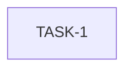

# Pre-Phase-4 Fix Plan v2

**Branch:** `pre-phase-4`
**Review source:** `notes/pr-reviews/pre-phase-4/review.md`
**Date:** 2026-04-18

---

## Summary

One issue found in v2 review: `interrupt_handle()` is dead code — it was added to enable test signal injection but all tests access `wf.interrupt` directly. Remove it.

---

## Parallel Groups

- **Group A (single task):** TASK-1 — standalone change, no dependencies.

---

### TASK-1: Remove dead `interrupt_handle()` method

**File:** `workflow_core/src/workflow.rs`
**Severity:** Minor

**Context:** The method was added per the PLAN.md to expose signal injection for tests. However, existing unit tests access `wf.interrupt` directly (a `pub(crate)` field):
- `wf.interrupt.store(true, Ordering::SeqCst)` (in `interrupt_before_run_dispatches_nothing`)
- `wf.interrupt = Arc::clone(&flag)` (in `interrupt_mid_run_stops_dispatch`)

No test in `src/` or `tests/` ever calls `interrupt_handle()`. The method is dead code.

**Before** (in `impl Workflow`, after `with_max_parallel`):
```rust
    /// Returns a reference to the interrupt handle for testing signal injection.
    ///
    /// This method provides an `Arc<AtomicBool>` that can be used in tests to
    /// simulate system signals (SIGINT/SIGTERM) before workflow execution begins.
    ///
    /// # Note
    /// This is the intended signal-injection point for testing, not a general-purpose
    /// pause mechanism. Users should not call this method outside of test code.
    #[cfg(test)]
    pub fn interrupt_handle(&self) -> Arc<AtomicBool> {
        Arc::clone(&self.interrupt)
    }
```

**After:** Delete the entire block above (doc comment + attribute + method body — 11 lines total).

**Verification:**
```bash
cd /Users/tony/programming/castep_workflow_framework && cargo test -p workflow_core
```

Expected: all tests pass; no reference to `interrupt_handle` remains in the codebase.

**Depends on:** None
**Enables:** None

---

## Dependency Graph



Single independent task.

## Execution Phases

| Phase | Tasks | Notes |
|-------|-------|-------|
| Phase 1 | TASK-1 | Standalone |

## Final Verification

```bash
cd /Users/tony/programming/castep_workflow_framework && cargo test -p workflow_core
```
