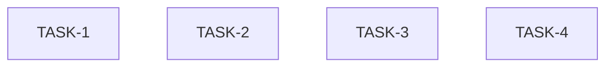

# Pre-Phase-4 Fix Plan v1

**Branch:** `pre-phase-4`
**Review source:** `notes/pr-reviews/pre-phase-4/review.md`

---

## Parallel Groups

- **Group A (parallel):** TASK-1, TASK-2, TASK-3, TASK-4 — all touch different files, no dependencies between them.

---

### TASK-1: Replace fragile hook ordering assertions with set-based checks

**File:** `workflow_core/tests/hook_recording.rs`
**Severity:** Blocking

**Before** (in function `hooks_fire_on_start_complete_failure`, the success-calls block):
```rust
    // Check success task hooks (OnStart + OnComplete)
    let success_calls: Vec<_> = calls.iter()
        .filter(|(_name, id)| *id == "success")
        .collect();
    assert_eq!(success_calls.len(), 2);
    assert_eq!(success_calls[0].0, "onstart");
    assert_eq!(success_calls[1].0, "oncomplete");

    // Check failure task hooks (OnStart + OnFailure)
    let failure_calls: Vec<_> = calls.iter()
        .filter(|(_name, id)| *id == "failure")
        .collect();
    assert_eq!(failure_calls.len(), 2);
    assert_eq!(failure_calls[0].0, "onstart");
    assert_eq!(failure_calls[1].0, "onfailure");
```

**After:**
```rust
    // Check success task hooks (OnStart + OnComplete) — set-based, no ordering assumed
    let success_hooks: HashSet<_> = calls.iter()
        .filter(|(_, id)| id == "success")
        .map(|(name, _)| name.as_str())
        .collect();
    assert!(success_hooks.contains("onstart"), "success task must fire OnStart");
    assert!(success_hooks.contains("oncomplete"), "success task must fire OnComplete");
    assert!(!success_hooks.contains("onfailure"), "success task must NOT fire OnFailure");

    // Check failure task hooks (OnStart + OnFailure) — set-based, no ordering assumed
    let failure_hooks: HashSet<_> = calls.iter()
        .filter(|(_, id)| id == "failure")
        .map(|(name, _)| name.as_str())
        .collect();
    assert!(failure_hooks.contains("onstart"), "failure task must fire OnStart");
    assert!(failure_hooks.contains("onfailure"), "failure task must fire OnFailure");
    assert!(!failure_hooks.contains("oncomplete"), "failure task must NOT fire OnComplete");
```

**Additional change** — add `HashSet` import. At the top of the file, the existing import is:
```rust
use std::collections::HashMap;
```
Change to:
```rust
use std::collections::{HashMap, HashSet};
```

**Also remove** the misleading ordering comment. Change:
```rust
    // Expected order: success OnStart, failure OnStart, success OnComplete, failure OnFailure
    assert_eq!(calls.len(), 4);
```
To:
```rust
    // 4 hook calls total: 2 per task (no ordering assumed across tasks)
    assert_eq!(calls.len(), 4);
```

**Verification:**
```bash
cd /Users/tony/programming/castep_workflow_framework && cargo test -p workflow_core --test hook_recording hooks_fire_on_start_complete_failure
```

**Depends on:** None
**Enables:** None

---

### TASK-2: Gate `interrupt_handle()` behind `#[cfg(test)]`

**File:** `workflow_core/src/workflow.rs`
**Severity:** Major

**Before** (the `interrupt_handle` method on `Workflow`):
```rust
    pub fn interrupt_handle(&self) -> Arc<AtomicBool> {
```

**After:**
```rust
    #[cfg(test)]
    pub fn interrupt_handle(&self) -> Arc<AtomicBool> {
```

**Verification:**
```bash
cd /Users/tony/programming/castep_workflow_framework && cargo test -p workflow_core
```

**Depends on:** None
**Enables:** None

---

### TASK-3: Invoke `mock_castep` via `sh` to avoid execute-bit fragility

**File:** `workflow_core/tests/hubbard_u_sweep.rs`
**Severity:** Minor

**Before** (inside the `for u in [0.0_f64, 1.0, 2.0]` loop, the `ExecutionMode::Direct` block):
```rust
                ExecutionMode::Direct {
                    command: "mock_castep".into(),
                    args: vec!["ZnO".into()],
                    env,
                    timeout: None,
                },
```

**After:**
```rust
                ExecutionMode::Direct {
                    command: "sh".into(),
                    args: vec![
                        bin_dir.join("mock_castep").to_string_lossy().into_owned(),
                        "ZnO".into(),
                    ],
                    env,
                    timeout: None,
                },
```

This also removes the need for `mock_castep` to be on `PATH`, so the `path_val` / `PATH` env manipulation becomes unnecessary. However, to keep the change minimal and avoid breaking anything, keep the PATH setup as-is — it's harmless.

**Verification:**
```bash
cd /Users/tony/programming/castep_workflow_framework && cargo test -p workflow_core --test hubbard_u_sweep
```

**Depends on:** None
**Enables:** None

---

### TASK-4: Move impl-specific doc paragraphs from `StateStore` trait to `JsonStateStore`

**File:** `workflow_core/src/state.rs`
**Severity:** Minor

**Before** (the `StateStore` trait doc comment — the full block between `/// State management interface` and `pub trait StateStore`):
```rust
/// State management interface for workflow execution.
///
/// This trait defines the contract for persisting and retrieving task status during
/// live workflow runs. Implementations handle runtime mutation of task states as
/// the workflow progresses, ensuring durability through periodic saves.
///
/// Crash Recovery and Resume:
/// The `JsonStateStore` implementation provides automatic crash recovery semantics.
/// When loading via `JsonStateStore::load`, any tasks marked as `Running`, `Failed`, or
/// `SkippedDueToDependencyFailure` are automatically reset to `Pending`. This ensures
/// that incomplete or failed runs can be safely resumed without stale state blocking
/// progress. Note that `Skipped` and `SkippedDueToDependencyFailure` (when not in
/// a failed context) are preserved as-is.
///
/// Read-Only Inspection:
/// For read-only status inspection (e.g., CLI display, `workflow inspect` commands),
/// use `JsonStateStore::load_raw`. Unlike `load`, this method does not apply crash
/// recovery resets and returns the state exactly as persisted to disk.
///
/// Workflow Summary:
/// The `summary` method on `StateStoreExt` aggregates all task statuses into a
/// concise overview (pending, running, completed, failed, skipped counts) suitable
/// for progress reporting and export.
///
/// Persistence Semantics:
/// The `load` and `load_raw` methods described above are specific to the
/// `JsonStateStore` implementation, not part of this trait. For details on how
/// state is persisted to disk (atomic writes via temp file + rename) and crash
/// recovery behavior, see the `JsonStateStore` documentation.
pub trait StateStore: Send + Sync {
```

**After:**
```rust
/// State management interface for workflow execution.
///
/// This trait defines the contract for persisting and retrieving task status during
/// live workflow runs. Implementations handle runtime mutation of task states as
/// the workflow progresses, ensuring durability through periodic saves.
///
/// Workflow Summary:
/// The `summary` method on `StateStoreExt` aggregates all task statuses into a
/// concise overview (pending, running, completed, failed, skipped counts) suitable
/// for progress reporting and export.
pub trait StateStore: Send + Sync {
```

**Then** add the removed paragraphs to the `JsonStateStore` struct doc. Change:
```rust
/// JSON-based state store implementation.
#[derive(Debug, Serialize, Deserialize)]
pub struct JsonStateStore {
```

To:
```rust
/// JSON-based state store implementation.
///
/// # Crash Recovery and Resume
///
/// When loading via [`JsonStateStore::load`], any tasks marked as `Running`, `Failed`, or
/// `SkippedDueToDependencyFailure` are automatically reset to `Pending`. This ensures
/// that incomplete or failed runs can be safely resumed without stale state blocking
/// progress. Note that `Skipped` and `SkippedDueToDependencyFailure` (when not in
/// a failed context) are preserved as-is.
///
/// # Read-Only Inspection
///
/// For read-only status inspection (e.g., CLI display, `workflow inspect` commands),
/// use [`JsonStateStore::load_raw`]. Unlike `load`, this method does not apply crash
/// recovery resets and returns the state exactly as persisted to disk.
///
/// # Persistence Semantics
///
/// State is persisted to disk via atomic writes (temp file + rename). See [`JsonStateStore::load`]
/// and [`JsonStateStore::load_raw`] for details on crash recovery behavior.
#[derive(Debug, Serialize, Deserialize)]
pub struct JsonStateStore {
```

**Verification:**
```bash
cd /Users/tony/programming/castep_workflow_framework && cargo doc -p workflow_core --no-deps 2>&1 | head -5 && cargo test -p workflow_core
```

**Depends on:** None
**Enables:** None

---

## Dependency Graph



All four tasks are independent — no edges.

## Execution Phases

| Phase | Tasks | Notes |
|-------|-------|-------|
| Phase 1 (parallel) | TASK-1, TASK-2, TASK-3, TASK-4 | All independent, different files |

## Final Verification

After all tasks are applied:
```bash
cd /Users/tony/programming/castep_workflow_framework && cargo test -p workflow_core
```
