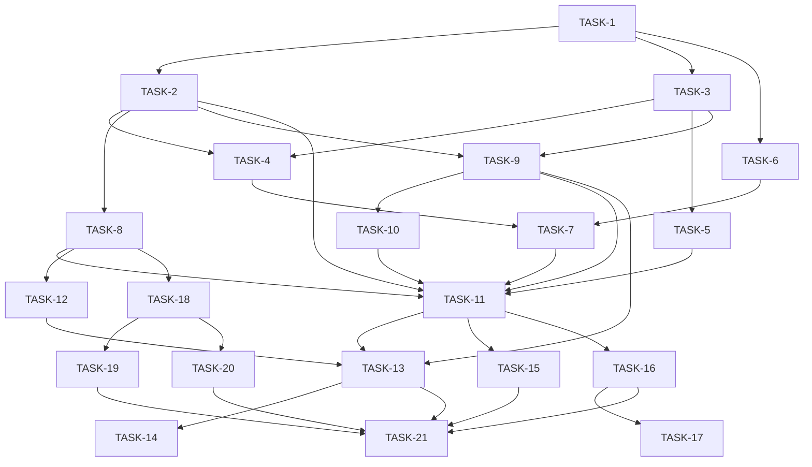

# Phase 3: Production Trust -- Implementation Plan (Final)

## 1. Plan Summary

Phase 3 transforms the workflow framework from "tests pass" into "trustworthy for overnight HPC cluster runs." It introduces structured error handling, trait-based abstraction boundaries (StateStore, ProcessRunner, HookExecutor), a three-phase Task lifecycle model (setup/execution/collect), signal handling for clean HPC preemption, and a CLI for post-run inspection. The dependency direction between `workflow_core` and `workflow_utils` is flipped so that core owns the abstractions and utils provides concrete implementations.

---

## 2. Task Breakdown

---

#### TASK-1: Define `WorkflowError` enum in `workflow_core`
- **Scope**: Create `workflow_core/src/error.rs` containing the `WorkflowError` enum and re-export it from `workflow_core/src/lib.rs`.
- **Crate/Module**: `workflow_core/src/error.rs`, `workflow_core/src/lib.rs`, `workflow_core/Cargo.toml`
- **Responsible For**: Defining the single error type used across all of `workflow_core`'s public API.
- **Depends On**: None
- **Enables**: TASK-2, TASK-3, TASK-5, TASK-6, TASK-8, TASK-9, TASK-11
- **Can Run In Parallel With**: None (foundational)
- **Acceptance Criteria**:
  - `workflow_core/src/error.rs` exists with the `WorkflowError` enum as specified below.
  - `thiserror` is added to `workflow_core/Cargo.toml` dependencies.
  - `pub use error::WorkflowError;` is in `workflow_core/src/lib.rs`.
  - `cargo check -p workflow_core` succeeds (existing code can still use `anyhow` internally for now).
- **Notes for Subagent**: The exact enum:
  ```rust
  #[derive(Debug, thiserror::Error)]
  #[non_exhaustive]
  pub enum WorkflowError {
      #[error("duplicate task id: {0}")]
      DuplicateTaskId(String),
      #[error("dependency cycle detected")]
      CycleDetected,
      #[error("unknown dependency '{dependency}' in task '{task}'")]
      UnknownDependency { task: String, dependency: String },
      #[error("state file corrupted: {0}")]
      StateCorrupted(String),
      #[error("task '{0}' timed out")]
      TaskTimeout(String),
      #[error(transparent)]
      Io(#[from] std::io::Error),
      #[error("workflow interrupted by signal")]
      Interrupted,
  }
  ```
  Do NOT change existing function signatures yet -- just define the type and re-export it. Existing code keeps using `anyhow::Result` until TASK-2 migrates it.

---

#### TASK-2: Migrate `workflow_core` public API from `anyhow::Result` to `Result<T, WorkflowError>`
- **Scope**: Change all public function signatures in `workflow_core` (dag.rs, workflow.rs, state.rs) from `anyhow::Result<T>` to `Result<T, WorkflowError>`, update internal error construction to use the enum variants, and write error-contract tests.
- **Crate/Module**: `workflow_core/src/dag.rs`, `workflow_core/src/workflow.rs`, `workflow_core/src/state.rs`, `workflow_core/src/lib.rs`
- **Responsible For**: The actual signature migration from anyhow to typed errors, and TDD tests for error contracts.
- **Depends On**: TASK-1
- **Enables**: TASK-4, TASK-8, TASK-9, TASK-11
- **Can Run In Parallel With**: TASK-3, TASK-6
- **Acceptance Criteria**:
  - `Dag::add_node` returns `Result<(), WorkflowError>` with `WorkflowError::DuplicateTaskId`.
  - `Dag::add_edge` returns `Result<(), WorkflowError>` with `WorkflowError::CycleDetected` or `WorkflowError::UnknownDependency`.
  - `WorkflowState::load` returns `Result<Self, WorkflowError>` with `WorkflowError::StateCorrupted` for parse errors and `WorkflowError::Io` for file errors.
  - `WorkflowState::save` returns `Result<(), WorkflowError>`.
  - `Workflow::add_task`, `Workflow::run`, `Workflow::dry_run` all return `Result<T, WorkflowError>`.
  - Error-contract tests:
    1. `add_task` with duplicate ID returns `WorkflowError::DuplicateTaskId`.
    2. `add_edge` creating a cycle returns `WorkflowError::CycleDetected`.
    3. Unknown dependency returns `WorkflowError::UnknownDependency`.
    4. Loading corrupted JSON returns `WorkflowError::StateCorrupted`.
  - All existing tests in `workflow_core` updated and pass.
  - `cargo check -p workflow_core` and `cargo test -p workflow_core` both succeed.
- **Notes for Subagent**: `anyhow` can remain as a dev-dependency for test convenience. The `Workflow::run` method currently returns `Result<()>` via `anyhow` -- change it to `Result<(), WorkflowError>`. Internal uses of `anyhow::bail!` become `return Err(WorkflowError::...)`. The `bon` builder's `build()` method should keep its own error type (bon-generated); only the methods YOU define change. The `?` operator on `std::io::Error` works automatically via `#[from]`. For `serde_json::Error` in state loading, map it: `.map_err(|e| WorkflowError::StateCorrupted(e.to_string()))`.

---

#### TASK-3: Move monitoring types from `workflow_utils` to `workflow_core`
- **Scope**: Move `MonitoringHook`, `HookTrigger`, `HookContext`, `HookResult` structs/enums into a new `workflow_core/src/monitoring.rs`. Remove the `execute()` method (it stays in `workflow_utils` as a standalone function). Update re-exports in both crates.
- **Crate/Module**: `workflow_core/src/monitoring.rs` (NEW), `workflow_core/src/lib.rs`, `workflow_utils/src/monitoring.rs`, `workflow_utils/src/lib.rs`
- **Responsible For**: Flipping the dependency direction -- monitoring data types live in core.
- **Depends On**: TASK-1
- **Enables**: TASK-5, TASK-9
- **Can Run In Parallel With**: TASK-2, TASK-6
- **Acceptance Criteria**:
  - `workflow_core/src/monitoring.rs` contains `MonitoringHook`, `HookTrigger`, `HookContext`, `HookResult` (data types only, NO `execute` method).
  - `workflow_core/src/lib.rs` has `pub mod monitoring;` and re-exports the types.
  - `workflow_utils/src/monitoring.rs` retains `MonitoringHook::execute()` as a free function: `pub fn execute_hook(hook: &MonitoringHook, ctx: &HookContext) -> Result<HookResult>`.
  - `workflow_utils/Cargo.toml` now depends on `workflow_core = { path = "../workflow_core" }`.
  - `workflow_core/Cargo.toml` NO LONGER depends on `workflow_utils`.
  - `workflow_core/src/task.rs` imports `MonitoringHook` from `crate::monitoring` instead of `workflow_utils`.
  - `workflow_core/src/workflow.rs` imports hook types from `crate::monitoring` instead of `workflow_utils`.
  - `cargo check --workspace` succeeds.
  - All existing tests pass.
- **Notes for Subagent**: The dependency flip is the key architectural change. After this task, `workflow_core` has ZERO dependency on `workflow_utils`, and `workflow_utils` depends on `workflow_core`. The `execute()` method uses `TaskExecutor` which lives in `workflow_utils`, so it cannot move to core. Preferred approach: make it a free function `execute_hook()` in `workflow_utils/src/monitoring.rs` that takes `&MonitoringHook` and `&HookContext`. Re-export the data types from `workflow_utils` for backward compat: `pub use workflow_core::monitoring::*;` in `workflow_utils/src/lib.rs`.

---

#### TASK-4: Update `ExecutionHandle` to own `Child` and remove `nix` PID usage
- **Scope**: Refactor `ExecutionHandle` in `workflow_utils/src/executor.rs` to use the owned `Child` handle for process management instead of raw PID + nix signals.
- **Crate/Module**: `workflow_utils/src/executor.rs`, `workflow_utils/Cargo.toml`
- **Responsible For**: Making process management safe and portable by using `std::process::Child` directly.
- **Depends On**: TASK-2, TASK-3
- **Enables**: TASK-7
- **Can Run In Parallel With**: TASK-5, TASK-6
- **Acceptance Criteria**:
  - `ExecutionHandle` fields become:
    ```rust
    pub struct ExecutionHandle {
        child: Child,  // std::process::Child -- NOT Option<Child>
    }
    ```
  - `pid()` method extracts PID from the owned child: `self.child.id() as i32`.
  - `is_running()` uses `self.child.try_wait()` instead of `nix::sys::wait::waitpid`:
    ```rust
    pub fn is_running(&mut self) -> bool {
        matches!(self.child.try_wait(), Ok(None))
    }
    ```
    Note: `is_running` now takes `&mut self` because `try_wait` requires `&mut self`.
  - `terminate()` uses `self.child.kill()`:
    ```rust
    pub fn terminate(&mut self) -> Result<(), WorkflowError> {
        self.child.kill().map_err(WorkflowError::Io)
    }
    ```
  - `spawn()` method in `TaskExecutor` stores the `Child` directly:
    ```rust
    pub fn spawn(&self) -> Result<ExecutionHandle, WorkflowError> {
        let child = std::process::Command::new(&self.command)
            .args(&self.args)
            .envs(&self.env)
            .current_dir(&self.workdir)
            .spawn()
            .map_err(WorkflowError::Io)?;
        Ok(ExecutionHandle { child })
    }
    ```
    PID is extracted from the child on demand via `pid()`, not cached at spawn time.
  - `nix` is removed from `workflow_utils/Cargo.toml` dependencies.
  - `nix` is removed from workspace `Cargo.toml` `[workspace.dependencies]`.
  - All existing tests pass.
- **Notes for Subagent**: The current code extracts `pid` at spawn time and stores it alongside `child`. After this change, only `child` is stored. The `pid()` accessor calls `self.child.id()` which is always available. The `is_running()` signature changes from `&self` to `&mut self` -- update all callers. `Child::kill()` sends SIGKILL, which is acceptable for now (graceful SIGTERM is handled at the workflow level in TASK-15).

---

#### TASK-5: Implement `HookExecutor` trait in `workflow_core`
- **Scope**: Define the `HookExecutor` trait in `workflow_core/src/monitoring.rs` and re-export it. Implement it as `ShellHookExecutor` in `workflow_utils`. Write mock-based tests for the trait contract.
- **Crate/Module**: `workflow_core/src/monitoring.rs`, `workflow_core/src/lib.rs`, `workflow_utils/src/monitoring.rs`
- **Responsible For**: Defining the trait abstraction for hook execution and providing the shell-based concrete implementation.
- **Depends On**: TASK-3
- **Enables**: TASK-11
- **Can Run In Parallel With**: TASK-4, TASK-6, TASK-7
- **Acceptance Criteria**:
  - The trait is defined exactly as:
    ```rust
    pub trait HookExecutor: Send + Sync {
        fn execute_hook(&self, hook: &MonitoringHook, ctx: &HookContext) -> Result<HookResult, WorkflowError>;
    }
    ```
  - `workflow_core/src/lib.rs` re-exports `HookExecutor`.
  - `workflow_utils/src/monitoring.rs` contains a concrete impl:
    ```rust
    pub struct ShellHookExecutor;

    impl workflow_core::HookExecutor for ShellHookExecutor {
        fn execute_hook(&self, hook: &MonitoringHook, ctx: &HookContext) -> Result<HookResult, WorkflowError> {
            let mut parts = hook.command.split_whitespace();
            let cmd = parts.next().unwrap_or_default();
            let args: Vec<String> = parts.map(String::from).collect();
            let result = TaskExecutor::new(&ctx.workdir)
                .command(cmd)
                .args(args)
                .env("TASK_ID", &ctx.task_id)
                .env("TASK_STATE", &ctx.state)
                .env("WORKDIR", ctx.workdir.to_string_lossy().as_ref())
                .env("EXIT_CODE", ctx.exit_code.map(|c| c.to_string()).unwrap_or_default())
                .execute()
                .map_err(|e| WorkflowError::Io(std::io::Error::other(e.to_string())))?;
            Ok(HookResult { success: result.success(), output: result.stdout })
        }
    }
    ```
  - Tests for the `HookExecutor` trait contract written alongside implementation: a mock executor that succeeds, and one that returns an error.
  - `cargo test -p workflow_core` and `cargo test -p workflow_utils` both pass.
- **Notes for Subagent**: The `ShellHookExecutor` replaces the old `MonitoringHook::execute()` method. Write mock tests in `workflow_core/src/monitoring.rs` using a local `MockExecutor` struct that implements `HookExecutor` -- no external process needed for the trait tests.

---

#### TASK-6: Define `ProcessRunner`, `ProcessHandle`, `ProcessResult` traits/types in `workflow_core`
- **Scope**: Define the process abstraction traits and the `ProcessResult` struct in `workflow_core/src/process.rs` (NEW file).
- **Crate/Module**: `workflow_core/src/process.rs` (NEW), `workflow_core/src/lib.rs`
- **Responsible For**: Defining the abstraction boundary for process execution so the workflow engine does not depend on a specific process runner.
- **Depends On**: TASK-1
- **Enables**: TASK-7, TASK-11
- **Can Run In Parallel With**: TASK-2, TASK-3, TASK-4, TASK-5
- **Acceptance Criteria**:
  - `workflow_core/src/process.rs` contains exactly:
    ```rust
    use std::collections::HashMap;
    use std::path::Path;
    use std::time::Duration;
    use crate::error::WorkflowError;

    pub trait ProcessRunner: Send + Sync {
        fn spawn(
            &self,
            workdir: &Path,
            command: &str,
            args: &[String],
            env: &HashMap<String, String>,
        ) -> Result<Box<dyn ProcessHandle>, WorkflowError>;
    }

    pub trait ProcessHandle: Send {
        fn is_running(&mut self) -> bool;
        fn terminate(&mut self) -> Result<(), WorkflowError>;
        fn wait(&mut self) -> Result<ProcessResult, WorkflowError>;
    }

    pub struct ProcessResult {
        pub exit_code: Option<i32>,
        pub stdout: String,
        pub stderr: String,
        pub duration: Duration,
    }
    ```
  - `workflow_core/src/lib.rs` has `pub mod process;` and re-exports `ProcessRunner`, `ProcessHandle`, `ProcessResult`.
  - `cargo check -p workflow_core` succeeds.
- **Notes for Subagent**: These are trait-only definitions -- no implementations in `workflow_core`. The concrete `SystemProcessRunner` will be implemented in `workflow_utils` (TASK-7). `ProcessHandle` is `Send` but not `Sync` -- a process handle is used from one thread at a time. `ProcessResult` is deliberately not a trait -- it's a plain data struct.

---

#### TASK-7: Implement `SystemProcessRunner` in `workflow_utils`
- **Scope**: Implement the `ProcessRunner` trait as `SystemProcessRunner` and `ProcessHandle` as `SystemProcessHandle` in `workflow_utils/src/executor.rs`. Write integration tests for the process runner.
- **Crate/Module**: `workflow_utils/src/executor.rs`, `workflow_utils/src/lib.rs`, `workflow_utils/tests/process_tests.rs` (NEW)
- **Responsible For**: Providing the concrete process execution implementation that wraps `std::process::Child`, and verifying its behavior with integration tests.
- **Depends On**: TASK-4, TASK-6
- **Enables**: TASK-11
- **Can Run In Parallel With**: TASK-5, TASK-8, TASK-9
- **Acceptance Criteria**:
  - `SystemProcessRunner` is defined:
    ```rust
    pub struct SystemProcessRunner;

    impl ProcessRunner for SystemProcessRunner {
        fn spawn(
            &self,
            workdir: &Path,
            command: &str,
            args: &[String],
            env: &HashMap<String, String>,
        ) -> Result<Box<dyn ProcessHandle>, WorkflowError> {
            let start = Instant::now();
            let child = std::process::Command::new(command)
                .args(args)
                .envs(env)
                .current_dir(workdir)
                .stdout(Stdio::piped())
                .stderr(Stdio::piped())
                .spawn()
                .map_err(WorkflowError::Io)?;
            Ok(Box::new(SystemProcessHandle { child, start }))
        }
    }
    ```
  - `SystemProcessHandle` wraps the existing `Child`:
    ```rust
    struct SystemProcessHandle {
        child: Child,
        start: Instant,
    }

    impl ProcessHandle for SystemProcessHandle {
        fn is_running(&mut self) -> bool {
            matches!(self.child.try_wait(), Ok(None))
        }

        fn terminate(&mut self) -> Result<(), WorkflowError> {
            self.child.kill().map_err(WorkflowError::Io)
        }

        fn wait(&mut self) -> Result<ProcessResult, WorkflowError> {
            let output = self.child.wait_with_output().map_err(WorkflowError::Io)?;
            Ok(ProcessResult {
                exit_code: output.status.code(),
                stdout: String::from_utf8_lossy(&output.stdout).into_owned(),
                stderr: String::from_utf8_lossy(&output.stderr).into_owned(),
                duration: self.start.elapsed(),
            })
        }
    }
    ```
  - `workflow_utils/src/lib.rs` re-exports `SystemProcessRunner`.
  - Integration tests in `workflow_utils/tests/process_tests.rs`:
    1. `SystemProcessRunner::spawn("echo", &["hello"])` succeeds, `wait()` returns exit code 0 and stdout containing "hello".
    2. `ProcessHandle::is_running()` returns true immediately after spawn, false after `wait()`.
    3. `ProcessHandle::terminate()` on `sleep 60` succeeds.
  - The existing `TaskExecutor` and `ExecutionHandle` types remain available (not removed yet).
  - `cargo test -p workflow_utils` passes.
- **Notes for Subagent**: `SystemProcessHandle` is a private struct -- only `SystemProcessRunner` is public. The `spawn()` pipes stdout/stderr (`Stdio::piped()`) so that `wait_with_output()` can capture them. The existing `TaskExecutor` is NOT deleted -- it coexists until the migration tasks (TASK-11/13) are complete. `ProcessRunner` and `ProcessHandle` are imported from `workflow_core` via the crate dependency.

---

#### TASK-8: Implement `StateStore` trait and `JsonStateStore`
- **Scope**: Define the `StateStore` trait, `StateStoreExt` extension trait, `StateSummary` struct, and refactor `WorkflowState` into `JsonStateStore` implementing `StateStore`. Write tests for the trait contract alongside the implementation.
- **Crate/Module**: `workflow_core/src/state.rs`, `workflow_core/src/lib.rs`
- **Responsible For**: Abstracting state persistence behind a trait boundary, providing the JSON implementation, and verifying the contract with tests.
- **Depends On**: TASK-2
- **Enables**: TASK-11, TASK-12, TASK-18
- **Can Run In Parallel With**: TASK-7, TASK-9
- **Acceptance Criteria**:
  - The trait, extension trait, and types are defined exactly as:
    ```rust
    pub trait StateStore: Send + Sync {
        fn get_status(&self, id: &str) -> Option<&TaskStatus>;
        fn set_status(&mut self, id: &str, status: TaskStatus);
        fn all_tasks(&self) -> &HashMap<String, TaskStatus>;
        fn save(&self) -> Result<(), WorkflowError>;
    }

    pub trait StateStoreExt: StateStore {
        fn mark_running(&mut self, id: &str) { self.set_status(id, TaskStatus::Running); }
        fn mark_completed(&mut self, id: &str) { self.set_status(id, TaskStatus::Completed); }
        fn mark_failed(&mut self, id: &str, error: String) { self.set_status(id, TaskStatus::Failed { error }); }
        fn mark_skipped(&mut self, id: &str) { self.set_status(id, TaskStatus::Skipped); }
        fn mark_skipped_due_to_dep_failure(&mut self, id: &str) { self.set_status(id, TaskStatus::SkippedDueToDependencyFailure); }
        fn is_completed(&self, id: &str) -> bool { matches!(self.get_status(id), Some(TaskStatus::Completed)) }
        fn summary(&self) -> StateSummary {
            let mut s = StateSummary { pending: 0, running: 0, completed: 0, failed: 0, skipped: 0 };
            for status in self.all_tasks().values() {
                match status {
                    TaskStatus::Pending => s.pending += 1,
                    TaskStatus::Running => s.running += 1,
                    TaskStatus::Completed => s.completed += 1,
                    TaskStatus::Failed { .. } => s.failed += 1,
                    TaskStatus::Skipped | TaskStatus::SkippedDueToDependencyFailure => s.skipped += 1,
                }
            }
            s
        }
    }
    impl<T: StateStore> StateStoreExt for T {}

    pub struct StateSummary {
        pub pending: usize,
        pub running: usize,
        pub completed: usize,
        pub failed: usize,
        pub skipped: usize,
    }
    ```
  - `JsonStateStore` is the renamed `WorkflowState` with an added `path: PathBuf` field:
    ```rust
    pub struct JsonStateStore {
        workflow_name: String,
        created_at: String,
        last_updated: String,
        tasks: HashMap<String, TaskStatus>,
        path: PathBuf,
    }
    ```
  - `JsonStateStore::new(name: &str, path: PathBuf) -> Self` constructor.
  - `JsonStateStore::load(path: impl AsRef<Path>) -> Result<Self, WorkflowError>` associated function.
  - `impl StateStore for JsonStateStore` with `save()` using atomic writes (write to temp file in same dir, then `std::fs::rename`).
  - **Backward compatibility**: `pub type WorkflowState = JsonStateStore;` type alias so existing code continues to compile.
  - Tests written alongside implementation:
    1. `JsonStateStore` implements `StateStore` — set and get round-trip.
    2. `StateStoreExt::mark_running/completed/failed` work via blanket impl.
    3. `StateStoreExt::is_completed` returns correct bool.
    4. `StateStoreExt::summary()` returns correct `StateSummary` counts.
    5. `StateStore::save` persists atomically, load round-trips.
  - All existing state tests updated to use `JsonStateStore` constructor.
  - `cargo test -p workflow_core` passes.
- **Notes for Subagent**: The `save()` trait method takes no path argument -- `JsonStateStore` stores the path internally. The `load()` method is an associated function, not part of the trait (different state stores load differently). Atomic write pattern:
  ```rust
  fn save(&self) -> Result<(), WorkflowError> {
      let tmp = self.path.with_extension("tmp");
      std::fs::write(&tmp, serde_json::to_vec_pretty(self).map_err(|e| WorkflowError::StateCorrupted(e.to_string()))?)?;
      std::fs::rename(&tmp, &self.path)?;
      Ok(())
  }
  ```
  The `last_updated` field should be set inside `set_status()`.

---

#### TASK-9: Redesign `Task` struct with three-phase lifecycle
- **Scope**: Replace the current `Task` struct (opaque `Arc<dyn Fn()>` closure) with the new three-phase lifecycle model using `ExecutionMode`.
- **Crate/Module**: `workflow_core/src/task.rs`
- **Responsible For**: The new Task data model.
- **Depends On**: TASK-2, TASK-3
- **Enables**: TASK-10, TASK-11
- **Can Run In Parallel With**: TASK-7, TASK-8
- **Acceptance Criteria**:
  - The new `Task` struct:
    ```rust
    use std::path::{Path, PathBuf};
    use crate::error::WorkflowError;
    use crate::monitoring::MonitoringHook;

    pub struct Task {
        pub id: String,
        pub dependencies: Vec<String>,
        pub workdir: PathBuf,
        pub setup: Option<Box<dyn Fn(&Path) -> Result<(), WorkflowError> + Send + Sync>>,
        pub execution: ExecutionMode,
        pub collect: Option<Box<dyn Fn(&Path) -> Result<(), WorkflowError> + Send + Sync>>,
        pub monitors: Vec<MonitoringHook>,
    }
    ```
  - `ExecutionMode` enum:
    ```rust
    use std::time::Duration;

    pub enum ExecutionMode {
        Direct {
            command: String,
            args: Vec<String>,
            timeout: Option<Duration>,
        },
        Queued {
            submit_cmd: String,
            poll_cmd: String,
            cancel_cmd: String,
        },
    }
    ```
  - Closure types are `Box<dyn Fn(&Path) -> Result<(), WorkflowError> + Send + Sync>` (NOT `Arc`). Each task is consumed from the HashMap during dispatch, so `Box` is sufficient.
  - `timeout` lives in `ExecutionMode::Direct`, NOT as a field on `Task`.
  - Builder methods:
    ```rust
    impl Task {
        pub fn new(id: impl Into<String>, execution: ExecutionMode) -> Self { ... }
        pub fn depends_on(mut self, id: impl Into<String>) -> Self { ... }
        pub fn workdir(mut self, path: impl Into<PathBuf>) -> Self { ... }
        pub fn setup<F>(mut self, f: F) -> Self where F: Fn(&Path) -> Result<(), WorkflowError> + Send + Sync + 'static { ... }
        pub fn collect<F>(mut self, f: F) -> Self where F: Fn(&Path) -> Result<(), WorkflowError> + Send + Sync + 'static { ... }
        pub fn monitors(mut self, hooks: Vec<MonitoringHook>) -> Self { ... }
        pub fn add_monitor(mut self, hook: MonitoringHook) -> Self { ... }
    }
    ```
  - The old `execute_fn` field is completely removed.
  - Existing tests in `task.rs` are updated to use the new constructor.
  - `cargo check -p workflow_core` succeeds.
- **Notes for Subagent**: This is a breaking change -- the old `Task::new("id", || Ok(()))` signature no longer works. The new signature is `Task::new("id", ExecutionMode::Direct { command: "echo".into(), args: vec![], timeout: None })`. Existing tests in `task.rs` need updating. Tests in `workflow.rs` will break but are fixed in TASK-13. The `Queued` variant is defined but not implemented -- it exists so downstream code can prepare for HPC queue support.

---

#### TASK-10: Define `WorkflowSummary` struct
- **Scope**: Define the `WorkflowSummary` return type for `Workflow::run()` in `workflow_core/src/workflow.rs`.
- **Crate/Module**: `workflow_core/src/workflow.rs`, `workflow_core/src/lib.rs`
- **Responsible For**: The structured return value from workflow execution.
- **Depends On**: TASK-9
- **Enables**: TASK-11
- **Can Run In Parallel With**: None (small task, unblock TASK-11 quickly)
- **Acceptance Criteria**:
  - `WorkflowSummary` is defined exactly as:
    ```rust
    use std::time::Duration;

    pub struct WorkflowSummary {
        pub succeeded: Vec<String>,
        pub failed: Vec<(String, String)>,  // (task_id, error_message)
        pub skipped: Vec<String>,
        pub duration: Duration,
    }
    ```
  - Re-exported from `workflow_core/src/lib.rs`: `pub use workflow::WorkflowSummary;`.
  - `cargo check -p workflow_core` succeeds.
- **Notes for Subagent**: This is a data-only struct. It does NOT replace `WorkflowError` -- the `run()` method returns `Result<WorkflowSummary, WorkflowError>`. A workflow with partial failures returns `Ok(WorkflowSummary { failed: [...], ... })`. `Err(WorkflowError)` is reserved for infrastructure-level failures (cycle detection, state corruption, signal interruption). Individual task failures are NOT errors -- they are recorded in the summary.

---

#### TASK-11: Rewrite `Workflow::run()` execution engine
- **Scope**: Rewrite the `Workflow` struct to accept trait objects (`Box<dyn StateStore>`, `Arc<dyn ProcessRunner>`, `Arc<dyn HookExecutor>`) and rewrite the `run()` method to use the new Task lifecycle and return `WorkflowSummary`.
- **Crate/Module**: `workflow_core/src/workflow.rs`
- **Responsible For**: The core execution engine rewrite.
- **Depends On**: TASK-2, TASK-5, TASK-7, TASK-8, TASK-9, TASK-10
- **Enables**: TASK-12, TASK-13, TASK-15, TASK-16
- **Can Run In Parallel With**: None (convergence point)
- **Acceptance Criteria**:
  - `Workflow` struct:
    ```rust
    pub struct Workflow {
        pub name: String,
        tasks: HashMap<String, Task>,
        state: Box<dyn StateStore>,
        process_runner: Arc<dyn ProcessRunner>,
        hook_executor: Arc<dyn HookExecutor>,
        max_parallel: usize,
    }
    ```
  - Constructor:
    ```rust
    impl Workflow {
        pub fn new(
            name: impl Into<String>,
            state: Box<dyn StateStore>,
            process_runner: Arc<dyn ProcessRunner>,
            hook_executor: Arc<dyn HookExecutor>,
        ) -> Self {
            let max_parallel = std::thread::available_parallelism()
                .map(|n| n.get())
                .unwrap_or(4);
            Self {
                name: name.into(),
                tasks: HashMap::new(),
                state,
                process_runner,
                hook_executor,
                max_parallel,
            }
        }

        pub fn with_max_parallel(mut self, n: usize) -> Self {
            self.max_parallel = n;
            self
        }

        pub fn add_task(&mut self, task: Task) -> Result<(), WorkflowError> { /* ... */ }
        pub fn run(&mut self) -> Result<WorkflowSummary, WorkflowError> { /* ... */ }
    }
    ```
  - **Threading strategy**: Use `std::thread::spawn` (NOT `std::thread::scope`). When dispatching a task, take it from the `HashMap` (it is consumed). The `setup` and `collect` closures can be wrapped in `Arc` at dispatch time for the spawned thread. The `ProcessRunner` is `Arc`-cloned for sharing across threads.
  - **Error contract**:
    - `Ok(WorkflowSummary)` is returned even when individual tasks fail.
    - `Err(WorkflowError::CycleDetected)` if the DAG has a cycle.
    - `Err(WorkflowError::Interrupted)` if a signal is caught (TASK-15).
    - `Err(WorkflowError::Io(...))` if state save fails.
  - The `run()` loop dispatches tasks using `ExecutionMode::Direct`:
    1. Run `task.setup` closure if present (in the spawned thread).
    2. Spawn the process via `self.process_runner.spawn(...)`.
    3. Wait for it via `handle.wait()`.
    4. Run `task.collect` closure if present (in the spawned thread).
  - `ExecutionMode::Queued` returns `Err(WorkflowError::Io(std::io::Error::other("queued execution not yet implemented")))` for now.
  - **Critical**: `done_set` for `dag.ready_tasks()` must include `Completed | Skipped | SkippedDueToDependencyFailure` but NOT `Failed` or `Running`. This is the mechanism that triggers skip-propagation.
  - The `bon` builder is removed -- use the plain `Workflow::new()` constructor + `with_max_parallel()` chain.
  - The old `resume()` method is removed (resume logic is handled by loading a `JsonStateStore` and passing it in).
  - `PeriodicHookManager` is updated to use `self.hook_executor` instead of calling `hook.execute()` directly.
  - `cargo check -p workflow_core` succeeds.
- **Notes for Subagent**: The state is mutated from the main loop thread only (not from worker threads), so `Box<dyn StateStore>` is fine without `Mutex`. Worker threads report back via `JoinHandle<Result<ProcessResult, WorkflowError>>`. Instead of `Arc::clone(&t.execute_fn)`, extract the task from `self.tasks` and use `process_runner.spawn(workdir, command, args, env)`. Instead of calling `hook.execute(&ctx)` directly, call `self.hook_executor.execute_hook(&hook, &ctx)`.

---

#### TASK-12: Resume resets `Failed` -> `Pending`
- **Scope**: Update `JsonStateStore::load()` to reset `Failed` and `SkippedDueToDependencyFailure` statuses to `Pending`, in addition to the existing `Running` -> `Pending` reset.
- **Crate/Module**: `workflow_core/src/state.rs`
- **Responsible For**: Enabling automatic retry of failed tasks on resume.
- **Depends On**: TASK-8
- **Enables**: TASK-13
- **Can Run In Parallel With**: TASK-11
- **Acceptance Criteria**:
  - `JsonStateStore::load()` resets `Running`, `Failed { .. }`, and `SkippedDueToDependencyFailure` to `Pending`.
  - A test verifies: save state with failed+skipped tasks, load, assert all are `Pending`.
  - Existing resume test updated.
  - `cargo test -p workflow_core` passes.
- **Notes for Subagent**: The current `WorkflowState::load()` already resets `Running` -> `Pending`. Add the two additional resets in the same loop.

---

#### TASK-13: Migrate existing tests to new API
- **Scope**: Update all existing tests across the workspace to use the new Task model, StateStore trait, and Workflow constructor.
- **Crate/Module**: `workflow_core/src/workflow.rs` (tests), `workflow_core/src/task.rs` (tests), `examples/hubbard_u_sweep/src/main.rs`
- **Responsible For**: Test migration to the new API.
- **Depends On**: TASK-9, TASK-11, TASK-12
- **Enables**: TASK-14
- **Can Run In Parallel With**: TASK-15
- **Acceptance Criteria**:
  - All tests compile and pass.
  - `cargo test --workspace` passes.
  - `cargo check -p hubbard_u_sweep` succeeds.
- **Notes for Subagent**: Per-file migration guide:

  **File: `workflow_core/src/task.rs` (2 tests)**
  - Replace `Task::new("id", || Ok(()))` with `Task::new("id", ExecutionMode::Direct { command: "true".into(), args: vec![], timeout: None })`.
  - `task_builder`: update constructor, assert `execution` field instead of `execute_fn`.
  - `depends_on_chaining`: update constructor only.

  **File: `workflow_core/src/workflow.rs` (10 tests)**
  - Every test that creates a `Workflow` must change from `Workflow::builder().name(...).state_dir(...).build()` to:
    ```rust
    let state = Box::new(JsonStateStore::new("wf_name", dir.path().join(".wf_name.workflow.json")));
    let runner = Arc::new(workflow_utils::SystemProcessRunner);
    let executor = Arc::new(workflow_utils::ShellHookExecutor);
    let mut wf = Workflow::new("wf_name", state, runner, executor).with_max_parallel(4);
    ```
  - Add `workflow_utils` as a dev-dependency if not already present.
  - Tests that used closure-based tasks must be rewritten to use `ExecutionMode::Direct` with actual commands (e.g., `"true"` for success, `"false"` for failure) or use `setup`/`collect` closures for side-effect logic.
  - `single_task_completes`: Use `ExecutionMode::Direct { command: "true", ... }` and a `setup` closure to set the flag.
  - `chain_respects_order`: Use `setup` closures to push to the shared log vec.
  - `failed_task_skips_dependent`: Use `ExecutionMode::Direct { command: "false", ... }` for the failing task.
  - `resume_loads_existing_state`: Use `JsonStateStore::load()` for the second workflow.

  **File: `examples/hubbard_u_sweep/src/main.rs`**
  - Replace `Task::new(task_id, move || { ... })` with:
    ```rust
    Task::new(&task_id, ExecutionMode::Direct {
        command: "castep".into(),
        args: vec!["ZnO".into()],
        timeout: None,
    })
    .workdir(&workdir)
    .setup(move |workdir| {
        // file preparation logic
        Ok(())
    })
    ```
  - The `Workflow` construction uses `Workflow::new(...)` with `Arc::new(SystemProcessRunner)` and `Arc::new(ShellHookExecutor)`.

---

#### TASK-14: Remove stale workspace dependencies
- **Scope**: Remove unused workspace dependencies (`tokio`, `async-trait`, `tokio-rusqlite`, `tokio-util`, `toml`, `nix`, and conditionally `bon`) from `Cargo.toml`.
- **Crate/Module**: `Cargo.toml` (workspace root)
- **Responsible For**: Cleaning up dead dependencies.
- **Depends On**: TASK-13
- **Enables**: None
- **Can Run In Parallel With**: TASK-15, TASK-16
- **Acceptance Criteria**:
  - `tokio`, `async-trait`, `tokio-rusqlite`, `tokio-util`, `toml` removed from `[workspace.dependencies]`.
  - `nix` removed from `[workspace.dependencies]` (removed from `workflow_utils` in TASK-4).
  - `bon` removed from `[workspace.dependencies]` if no longer used (bon builder removed in TASK-11).
  - `cargo check --workspace` succeeds.
  - `cargo test --workspace` passes.
- **Notes for Subagent**: Check each dependency is truly unused before removing. `serde`, `petgraph`, `serde_json`, `anyhow`, `tracing`, `tracing-subscriber` are still used. Grep for `#[bon]` or `bon::` before removing `bon`.

---

#### TASK-15: Add signal handling (SIGTERM/SIGINT)
- **Scope**: Add `signal_hook`-based signal handling to `Workflow::run()` for clean shutdown on HPC preemption.
- **Crate/Module**: `workflow_core/src/workflow.rs`, `workflow_core/Cargo.toml`
- **Responsible For**: Graceful shutdown on signals.
- **Depends On**: TASK-11
- **Enables**: TASK-21
- **Can Run In Parallel With**: TASK-13, TASK-14, TASK-16
- **Acceptance Criteria**:
  - `signal-hook` is added to `workflow_core/Cargo.toml` dependencies (also add to workspace `Cargo.toml`: `signal-hook = "0.3"`).
  - The shutdown flag and installer:
    ```rust
    use std::sync::atomic::{AtomicBool, Ordering};
    use std::sync::Arc;

    pub(crate) fn install_signal_handler() -> Arc<AtomicBool> {
        let shutdown = Arc::new(AtomicBool::new(false));
        signal_hook::flag::register(signal_hook::consts::SIGTERM, shutdown.clone()).ok();
        signal_hook::flag::register(signal_hook::consts::SIGINT, shutdown.clone()).ok();
        shutdown
    }
    ```
  - `Workflow::run()` calls `install_signal_handler()` at the start and checks `shutdown.load(Ordering::Relaxed)` each iteration of the run loop.
  - On signal detection:
    1. Terminate all in-flight processes by calling `handle.terminate()` on each active `ProcessHandle`.
    2. Mark all currently `Running` tasks as `Pending` in the state store (so they retry on resume).
    3. Save state.
    4. Return `Err(WorkflowError::Interrupted)`.
  - A test verifies the shutdown flag mechanism (unit test with `AtomicBool`, no actual signal sending).
  - `cargo test -p workflow_core` passes.
- **Notes for Subagent**: `signal_hook::flag::register` sets the `AtomicBool` when the signal arrives. The `.ok()` swallows registration errors (e.g., in test environments). The run loop already polls with `sleep(50ms)`, so signal detection latency is at most 50ms. Do NOT use `signal_hook::iterator` -- the flag API is simpler and sufficient.

---

#### TASK-16: Direct mode timeout
- **Scope**: Implement timeout enforcement for `ExecutionMode::Direct` in the workflow run loop.
- **Crate/Module**: `workflow_core/src/workflow.rs`
- **Responsible For**: Killing tasks that exceed their timeout.
- **Depends On**: TASK-11
- **Enables**: TASK-17
- **Can Run In Parallel With**: TASK-13, TASK-14, TASK-15
- **Acceptance Criteria**:
  - When dispatching a `Direct` task with `timeout: Some(duration)`, the run loop tracks the spawn time.
  - Each poll iteration checks `elapsed > timeout` for running tasks.
  - On timeout: call `handle.terminate()`, mark task as `Failed { error: "timed out" }`, record in `WorkflowSummary::failed`.
  - A test spawns `sleep 60` with `timeout: Some(Duration::from_millis(100))` and verifies the task is terminated and marked failed.
  - `cargo test -p workflow_core` passes.
- **Notes for Subagent**: When starting a task, store the `Instant::now()` alongside the handle. In the poll loop, check `start.elapsed() > timeout`. On timeout, call `handle.terminate()` then `handle.wait()` to reap the process. The error message should be: `format!("task '{}' timed out after {:?}", task_id, timeout)`.

---

#### TASK-17: Write timeout integration test
- **Scope**: Write an integration test that exercises the full timeout flow end-to-end.
- **Crate/Module**: `workflow_core/tests/timeout_integration.rs` (NEW)
- **Responsible For**: Verifying timeout behavior in a realistic scenario.
- **Depends On**: TASK-16
- **Enables**: None
- **Can Run In Parallel With**: TASK-18
- **Acceptance Criteria**:
  - Test creates a workflow with two tasks: one that sleeps (with timeout), one that depends on it.
  - The sleeping task times out, the dependent task is skipped.
  - The `WorkflowSummary` shows the timeout task in `failed` and the dependent in `skipped`.
  - `timeout` is specified as `ExecutionMode::Direct { timeout: Some(Duration::from_millis(200)) }`, NOT as a field on `Task`.
  - Test completes in under 1 second.
  - `cargo test -p workflow_core` passes.
- **Notes for Subagent**: Use `ExecutionMode::Direct { command: "sleep".into(), args: vec!["60".into()], timeout: Some(Duration::from_millis(200)) }`. Use `tempdir` for state file isolation.

---

#### TASK-18: Delete stale `workflow_cli/` and create `workflow-cli/` crate
- **Scope**: Delete the existing `workflow_cli/` directory (dead code referencing non-existent crates) and create a new `workflow-cli/` crate with clap-based subcommands.
- **Crate/Module**: `workflow_cli/` (DELETE), `workflow-cli/` (NEW), `Cargo.toml` (workspace)
- **Responsible For**: The CLI binary for post-run inspection.
- **Depends On**: TASK-8
- **Enables**: TASK-19, TASK-20
- **Can Run In Parallel With**: TASK-17
- **Acceptance Criteria**:
  - `workflow_cli/` directory is completely deleted (it references non-existent crates `castep_adapter`, `lammps_adapter` and removed deps `tokio`, `toml`, `tokio-util`).
  - `workflow-cli/` is created fresh with:
    - `workflow-cli/Cargo.toml` with `name = "workflow-cli"`, bin target, deps on `workflow_core`, `clap`, `anyhow`.
    - `workflow-cli/src/main.rs` with clap derive-based CLI skeleton.
  - Workspace `Cargo.toml` `members` array: remove `"workflow_cli"` (if present), add `"workflow-cli"`.
  - `cargo check -p workflow-cli` succeeds.
- **Notes for Subagent**: The existing `workflow_cli/` is from a previous architecture iteration and must be fully deleted, not modified. The new crate is `workflow-cli` (hyphenated) per Rust convention for binary crates. Clap skeleton:
  ```rust
  use clap::{Parser, Subcommand};

  #[derive(Parser)]
  #[command(name = "workflow-cli", about = "Workflow state inspection tool")]
  struct Cli {
      #[command(subcommand)]
      command: Commands,
  }

  #[derive(Subcommand)]
  enum Commands {
      Status { state_file: String },
      Retry { state_file: String, #[arg(required = true)] task_ids: Vec<String> },
      Inspect { state_file: String, task_id: Option<String> },
  }

  fn main() -> anyhow::Result<()> {
      let cli = Cli::parse();
      match cli.command {
          Commands::Status { state_file } => todo!(),
          Commands::Retry { state_file, task_ids } => todo!(),
          Commands::Inspect { state_file, task_id } => todo!(),
      }
  }
  ```

---

#### TASK-19: Implement `workflow-cli status` and `inspect` subcommands
- **Scope**: Implement the `status` and `inspect` subcommands in `workflow-cli`.
- **Crate/Module**: `workflow-cli/src/main.rs`
- **Responsible For**: CLI state inspection functionality.
- **Depends On**: TASK-18
- **Enables**: TASK-21
- **Can Run In Parallel With**: TASK-20
- **Acceptance Criteria**:
  - `workflow-cli status <state-file>` prints: workflow name, completed/failed/skipped/pending counts (from `StateSummary`), and lists failed task IDs with their error messages.
  - `workflow-cli inspect <state-file>` (no task ID) prints all tasks and their statuses.
  - `workflow-cli inspect <state-file> <task-id>` prints the status of a single task.
  - Error handling: missing file prints a friendly error, not a panic.
  - `cargo test -p workflow-cli` passes (at least one test per subcommand).
- **Notes for Subagent**: Use `JsonStateStore::load(path)` to load the state file. Use `StateStoreExt::summary()` for the status command. For inspect, use `StateStore::get_status()` or `StateStore::all_tasks()`.

---

#### TASK-20: Implement `workflow-cli retry` subcommand
- **Scope**: Implement the `retry` subcommand that marks specific tasks and their downstream dependents as `Pending`.
- **Crate/Module**: `workflow-cli/src/main.rs`, possibly `workflow_core/src/state.rs` (add retry helper)
- **Responsible For**: CLI retry functionality.
- **Depends On**: TASK-18
- **Enables**: TASK-21
- **Can Run In Parallel With**: TASK-19
- **Acceptance Criteria**:
  - `workflow-cli retry <state-file> <task-id>...` loads state, marks the named tasks as `Pending`, marks all `SkippedDueToDependencyFailure` tasks as `Pending`, saves state.
  - If a task ID does not exist in the state file, print a warning but continue.
  - At least one test: retry a failed task, verify it and `SkippedDueToDependencyFailure` tasks are reset to `Pending`.
  - `cargo test -p workflow-cli` passes.
- **Notes for Subagent**: The retry logic does not require DAG knowledge -- mark the specified tasks as `Pending` and also mark any `SkippedDueToDependencyFailure` tasks as `Pending` (they will be re-evaluated on next run). If a more precise DAG-aware retry is desired in future, it can be added as a library function in `workflow_core`.

---

#### TASK-21: End-to-end integration test
- **Scope**: Write an integration test that exercises the complete workflow lifecycle: build, run, resume, CLI inspection.
- **Crate/Module**: `workflow_core/tests/integration.rs` (NEW)
- **Responsible For**: Verifying all Phase 3 components work together.
- **Depends On**: TASK-13, TASK-15, TASK-16, TASK-19, TASK-20
- **Enables**: None
- **Can Run In Parallel With**: None (final gate)
- **Acceptance Criteria**:
  - Test creates a 3-task workflow (A -> B -> C), runs it with B failing, verifies `WorkflowSummary`.
  - Loads state file, verifies B is `Failed` and C is `SkippedDueToDependencyFailure`.
  - Resumes the workflow (B now succeeds via `JsonStateStore::load()`), verifies all complete.
  - `cargo test -p workflow_core -- --test integration` passes.
- **Notes for Subagent**: Use `tempdir` for isolation. Use `ExecutionMode::Direct { command: "true"/"false" }`. The resume test creates a new `JsonStateStore::load(path)` and a new `Workflow` with corrected tasks.

---

## 3. Dependency Graph



---

## 4. Execution Phases

| Phase | Tasks | Notes |
|-------|-------|-------|
| Phase 1 | TASK-1 | Foundation: error type |
| Phase 2 (parallel) | TASK-2, TASK-3, TASK-6 | API migration, monitoring type move, process trait defs |
| Phase 3 (parallel) | TASK-4, TASK-5 | ExecutionHandle refactor, HookExecutor impl+tests |
| Phase 4 (parallel) | TASK-7, TASK-8, TASK-9 | SystemProcessRunner+tests, StateStore+tests, Task redesign |
| Phase 5 | TASK-10 | WorkflowSummary struct |
| Phase 6 (parallel) | TASK-11, TASK-12, TASK-18 | Workflow engine rewrite (critical path), resume reset, CLI crate setup |
| Phase 7 (parallel) | TASK-13, TASK-15, TASK-16, TASK-19, TASK-20 | Test migration, signal handling, timeout, CLI subcommands |
| Phase 8 (parallel) | TASK-14, TASK-17 | Workspace cleanup, timeout integration test |
| Phase 9 | TASK-21 | End-to-end integration test (final gate) |
